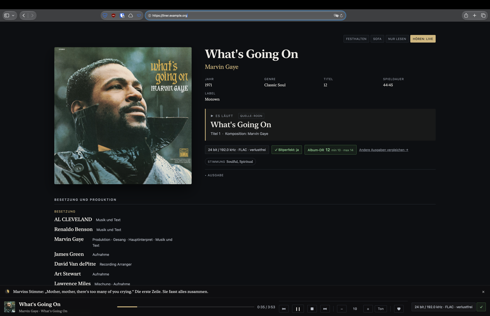
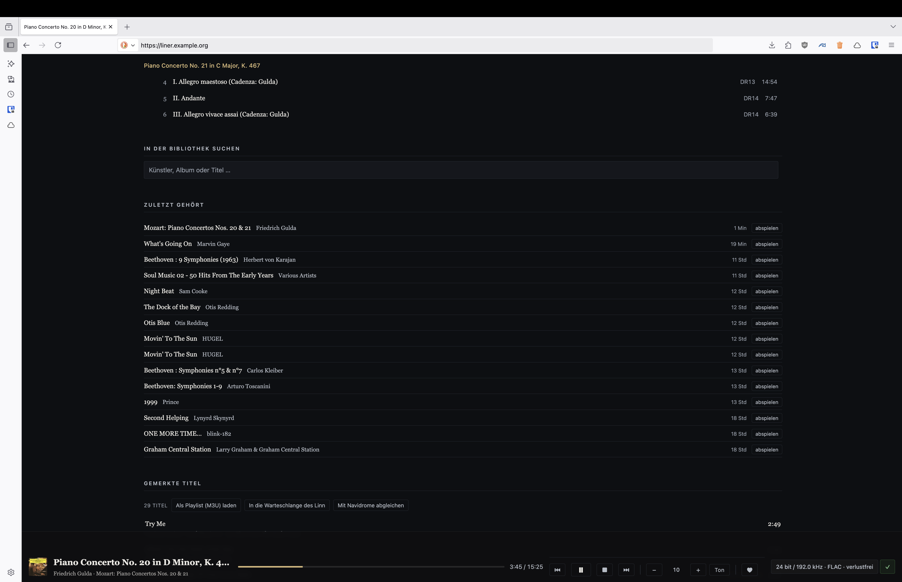
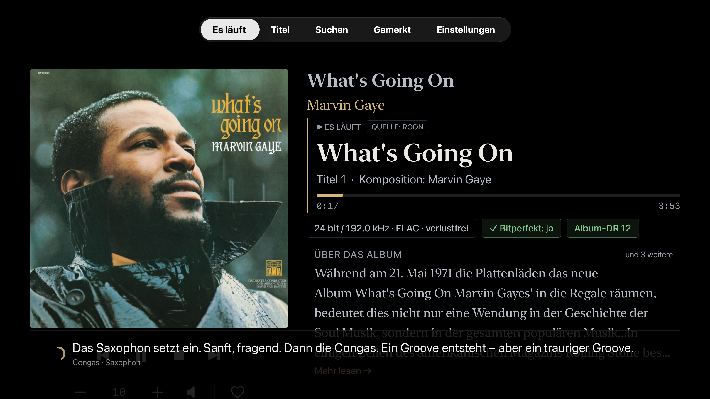

# LinerNotes

**Das digitale Booklet auf dem großen Bildschirm. / The digital booklet experience on the big screen.**

[Deutsch](#deutsch) · [English](#english)

## Deutsch

### Die Idee

Bei Schallplatten und CDs gehörte das Booklet zum Musikhören. Man konnte nachlesen, wer mitspielt, wie eine Aufnahme entstanden ist und was hinter einem Album steckt. Bei digitalen Medien gibt es diese Begleitmaterialien weiterhin – oft als PDF oder als Informationen in einer App. Zum Lesen greift man dann aber zum iPad, einem anderen Tablet oder zum PC oder Mac.

LinerNotes entstand aus dem Wunsch, diese Informationen beim Hören auch auf dem Fernseher zu sehen: gut lesbar, vom Sofa aus, passend zur laufenden Musik. Der Browser bleibt genauso nutzbar. Das eigene Gerät soll den Blick auf die Musik ergänzen, ohne dass man zum Lesen ständig ein Tablet in der Hand halten muss.

LinerNotes ist ein eigenständiges Projekt mit einem selbst betriebenen Server, einer Browseroberfläche und einer nativen App für Apple TV. Die optionale Verbindung zu [Hören-Lernen](https://github.com/hoerenlernen/hoeren-lernen) ergänzt zeitlich passende Hörhinweise: ein Instrument, ein Wechsel im Arrangement oder ein Detail, das man sonst vielleicht überhört.

**Wichtig zum aktuellen Umfang:** Die Booklet-Idee beschreibt die Motivation. Die jetzige Version zeigt verfügbare Albumtexte, Mitwirkende, Metadaten und Hörhinweise. Sie enthält noch keinen allgemeinen Viewer für mehrseitige PDF-Booklets und extrahiert solche PDFs nicht automatisch.

Ein Projekt von **Goran Ristic**, entstanden aus der eigenen Hörpraxis.

### Was LinerNotes heute kann

- Laufenden Titel, Cover, Albuminformationen und Mitwirkende anzeigen, soweit Daten vorhanden sind.
- Tracklisten, technische Audioangaben und zuvor ermittelte Dynamic-Range-Werte anzeigen.
- Musik über den verbundenen Linn steuern; der genaue Funktionsumfang hängt von Gerät und Quelle ab.
- Die Musikbibliothek über MinimServer durchsuchen und Titel in die Linn-Warteschlange legen.
- Favoriten und Hörverlauf führen; Favoriten optional mit Navidrome abgleichen.
- Für entsprechend vorbereitete Alben Hörhinweise aus Hören-Lernen einblenden.
- Die Browseransicht bei Pause bzw. Inaktivität abdunkeln, um statische helle Bildinhalte zu reduzieren. Das ist keine Garantie gegen Einbrennen.

### Einblicke

*Browseransicht in Safari. Die Adresse ist eine Beispieladresse.*

*Bibliothek, Hörverlauf und Merkliste in Firefox.*

*Native App im tvOS-Simulator, aufgenommen während echter Wiedergabe am verbundenen Linn.*

### Voraussetzungen und Grenzen

**Im Moment ist Linn die implementierte und im Alltag erprobte Player-Anbindung.** Das ist der Ausgangspunkt für gemeinsame Weiterentwicklung. Weitere OpenHome-Streamer kommen grundsätzlich als Kandidaten infrage; Unterstützung für andere Geräte darf durch Beiträge ihrer Nutzer wachsen.

Du verwendest beispielsweise einen NAD, Yamaha oder einen anderen Streamer? Beiträge zur Anbindung sind willkommen. Entscheidend sind das konkrete Modell und seine verfügbaren Schnittstellen: Ein Netzwerkstreamer ist nicht automatisch ein OpenHome-Gerät. Ohne passende OpenHome-Dienste braucht es eine eigene Anbindung. Navidrome allein reicht im aktuellen Stand nicht aus.

Wir dokumentieren die bestehende Linn-Anlage als Referenz. Unterstützung für weitere Marken ist keine Voraussetzung für die erste Veröffentlichung.

| Baustein | Rolle und derzeitiger Stand |
| --- | --- |
| Linn-Player im Netzwerk | Für den laufenden Betrieb erforderlich. Wiedergabestatus und Steuerung kommen über die vom Linn bereitgestellten OpenHome-Dienste. Andere OpenHome-Geräte sind nicht pauschal als kompatibel bestätigt. |
| Rechner für den LinerNotes-Server | Python-Umgebung und benötigte Pakete aus `requirements.txt`; im bisherigen Betrieb Debian. Der Rechner muss während der Nutzung laufen und den Player erreichen. |
| Eigene Musikbibliothek | Für vollständige lokale Albumzuordnung und Auswertung benötigt der Server Lesezugriff auf die FLAC-Dateien sowie einen aufgebauten LinerNotes-Index. Schreibbarer Speicher für die eigene Datenbank und Cover ist ebenfalls erforderlich. |
| MinimServer | Die implementierte Bibliothekssuche und die Auflösung abspielbarer URLs verwenden MinimServer. Andere Medienserver und ein vollständiger Ersatz durch Navidrome sind nicht verifiziert. Ohne MinimServer ist der Funktionsumfang eingeschränkt. |
| Roon | Optional. In der bisherigen Anlage wird auch Wiedergabe über Roon am Linn angezeigt. LinerNotes liest dabei den Linn aus; es gibt keinen eigenständigen Roon-Zonenadapter. |
| Navidrome | Optionaler Favoritenabgleich. Kein eigenständiger Wiedergabestatus- oder Streamingadapter. Benötigt Zugang zur API; die genaue Pfadzuordnung und der Import von Favoriten verwenden zusätzlich lesenden Zugriff auf die Navidrome-Datenbank. |
| Browser | Für die Webansicht. Safari und Firefox wurden in der bisherigen Anlage verwendet. |
| Apple TV | Optional für die native TV-App. Der Quellcode wird mit Xcode auf einem Mac gebaut und für das eigene Gerät signiert. Der Quellcode-Download ist keine fertig installierte Apple-TV-App. |
| Hören-Lernen | Optionales, separates Inhaltsrepository. Ohne diese Inhalte funktioniert die übrige Anzeige; Hörhinweise gibt es nur für zugeordnete, entsprechend aufbereitete Aufnahmen. |

Roon ist keine Pflicht. MinimServer bietet eine [dauerhaft kostenlose Starter Edition](https://minimserver.com/starter.html). Deren Eignung für sämtliche hier verwendeten Funktionen ist noch nicht getestet; eine vollständig verifizierte Installation ohne kostenpflichtige Serversoftware wird derzeit nicht versprochen.

LinerNotes überträgt die Musik nicht selbst an beliebige Endgeräte. Die vorhandene Wiedergabekette bleibt zuständig. Navidrome-Apps auf Smartphone oder Computer melden ihren Wiedergabestatus bislang nicht an LinerNotes.

### Einrichtung und Veröffentlichungsstand

Die erste Veröffentlichung richtet sich an technisch interessierte Nutzer und Mitwirkende. Die [Installationsanleitung](doku/installation.md) beschreibt den aktuellen Aufbau und die Einrichtung. Die bisherige Linn-Anlage ist die Hardware-Referenz; weitere Anlagen sind noch nicht verifiziert.

Die Konfigurationsvorlage ist [`.env.beispiel`](.env.beispiel). Sie beschreibt Player, Musikpfad, Medienserver und optionale Zugangsdaten. Diese Dienste werden nicht mitgeliefert oder automatisch eingerichtet. Die Python-Abhängigkeiten stehen in [`requirements.txt`](requirements.txt), der Serverstart in [`bin/start.sh`](bin/start.sh).

Für den Betrieb müssen Browser und TV-App den Server erreichen; für Ereignismeldungen muss auch der Linn den Server erreichen können. Automatische Gerätesuche erfordert ein passend konfiguriertes lokales Netzwerk. Die Steuerungs-API hat keine eigene Benutzeranmeldung: Zugriff nur aus einem vertrauenswürdigen Heimnetz oder über einen entsprechend abgesicherten Zugang/VPN.

Musikdateien werden im normalen Anzeige- und Indexbetrieb gelesen. Das gesonderte Wartungswerkzeug `tagvault.py restore --apply` kann Tags schreiben und gehört nicht zum normalen Start.

### Bekannte Einschränkung

Nach einer Pause in Roon ließ sich die Wiedergabe in der Referenzanlage über Play im LinerNotes-Browser nicht fortsetzen. Der Server empfing den Befehl und der Linn bestätigte ihn, ohne die Wiedergabe fortzusetzen. Die Ursache ist noch offen; der Vergleich mit direkt über die Linn-App gestarteter Wiedergabe steht aus. Ein Zusammenhang mit VPN ist nicht nachgewiesen.

Die Oberfläche ist derzeit deutschsprachig; diese Dokumentation ist zweisprachig.

### Mitmachen

Erfahrungen mit anderen Geräten, nachvollziehbare Fehlermeldungen, Dokumentation und Verbesserungsvorschläge sind willkommen. Bitte nenne bei Fehlern Serverversion, Player, Wiedergabequelle und die Schritte zum Nachstellen. Zugangsdaten, private Konfiguration und Musikdateien gehören nicht in Issues oder Pull Requests.

Für Geräteanbindungen beschreibt [Geräteunterstützung und Architektur](doku/geraeteanbindung.md) den aktuellen Datenfluss, Einstiegspunkte im Code und die nötigen Prüfungen. Eine fertige Plugin-Schnittstelle gibt es noch nicht.

Für die Hörtexte und weitere Aufnahmen führt der Weg zum eigenständigen Projekt [Hören-Lernen](https://github.com/hoerenlernen/hoeren-lernen).

### Lizenz

LinerNotes ist freie Software unter der **GNU General Public License, Version 3 (GPL-3.0-only)**. Copyright © 2026 Goran Ristic und Mitwirkende. Nutzung, Veränderung und Weitergabe sind unter den Bedingungen der [GPLv3](LICENSE) erlaubt. Bei Weitergabe abgeleiteter Versionen gelten die Quellcode- und Lizenzpflichten der GPL. Copyright-Hinweise müssen erhalten bleiben. Kommerzielle Nutzung und Verkauf sind erlaubt; die offizielle Veröffentlichung wird kostenlos angeboten.

Die separat bezogenen Hören-Lernen-Texte behalten ihre eigene CC-BY-NC-SA-4.0-Lizenz. Fremde Albumcover und Begleittexte in Screenshots sind nicht von der Softwarelizenz erfasst. Siehe [Rechtehinweise](NOTICE.md).

---

## English

### The idea

With vinyl records and CDs, the booklet was part of listening to music. You could read who played on a record, how it was made, and the story behind the album. Digital releases still offer some of this material, often as a PDF or information inside an app. Reading it usually means reaching for an iPad, another tablet, a PC or a Mac.

LinerNotes grew out of a wish to bring that information to the television while listening: readable from the sofa and connected to the music currently playing. A regular web browser works too. The screen should add to the listening experience without requiring you to keep a tablet in your hands.

LinerNotes is an independent project with a self-hosted server, a browser interface and a native Apple TV app. Its optional connection to [Hören-Lernen](https://github.com/hoerenlernen/hoeren-lernen) adds timed listening notes: an instrument to listen for, a change in the arrangement, or a detail you might otherwise miss.

**Current scope:** The booklet experience is the motivation. The current version displays available album texts, credits, metadata and listening notes. It does not yet include a general-purpose viewer for multipage PDF booklets or automatically extract their contents.

A project by **Goran Ristic**, developed from everyday listening at home.

### What LinerNotes can do today

- Display the current track, artwork, album information and credits where available.
- Show track lists, audio format information and previously calculated dynamic-range measurements.
- Control playback through the connected Linn; available commands depend on the device and source.
- Search the music library through MinimServer and add tracks to the Linn queue.
- Keep favourites and listening history; optionally synchronise favourites with Navidrome.
- Display Hören-Lernen notes for recordings with matching, prepared content.
- Dim the browser view during pause or inactivity to reduce bright static content. This is not a guarantee against screen burn-in.

The screenshots above show Safari, Firefox and the native app in the tvOS simulator. The browser addresses are examples. The simulator capture was taken during real playback on the connected Linn.

### Requirements and limitations

**For now, Linn is the implemented player integration, used in everyday listening.** It is the starting point for community development. Other OpenHome streamers are candidates for additional support, with contributions from people who own and can test those devices.

Using a NAD, Yamaha or another streamer? Contributions are welcome. Support depends on the specific model and its interfaces: a network streamer is not necessarily an OpenHome device. Devices without suitable OpenHome services need a separate integration. Navidrome alone is not sufficient in the current version.

We document the existing Linn setup as the reference. Support for other brands is not a prerequisite for the first release.

| Component | Role and current support |
| --- | --- |
| Networked Linn player | Required for live operation. Playback state and controls use the player's OpenHome services. Compatibility with other OpenHome devices is not generally verified. |
| Computer running the LinerNotes server | A Python environment with the packages in `requirements.txt`; the existing installation runs on Debian. This computer must remain available and be able to reach the player. |
| Your music library | Full local album matching and analysis require read access to FLAC files and a populated LinerNotes index. The application also needs writable storage for its own database and artwork. |
| MinimServer | The implemented library search and playable-URL resolution use MinimServer. Other media servers and a complete replacement with Navidrome have not been verified. Features are limited without MinimServer. |
| Roon | Optional. Playback through Roon to the Linn is displayed in the existing setup. LinerNotes reads the Linn; it has no independent Roon zone adapter. |
| Navidrome | Optional favourite synchronisation. There is no standalone playback-state or streaming adapter. API credentials are needed; exact path matching and importing favourites also use read access to the Navidrome database. |
| Web browser | For the web interface. Safari and Firefox have been used in the existing setup. |
| Apple TV | Optional for the native TV app. Build with Xcode on a Mac and sign for your device. Downloading the source does not install an Apple TV app. |
| Hören-Lernen | Optional, separate content repository. Other display features work without it; listening notes require a matched recording with prepared content. |

Roon is not required. MinimServer offers a [permanently free Starter Edition](https://minimserver.com/starter.html). Its suitability for all functions used here has not yet been tested. A fully verified setup without paid server software is not currently promised.

LinerNotes does not stream music to arbitrary devices itself. Your existing playback system remains responsible for audio. Navidrome clients on phones and computers do not currently report their playback state to LinerNotes.

### Setup and release status

The initial release is intended for technically interested users and contributors. The [installation guide](doku/installation.md#english) covers the current setup. The existing Linn system is the hardware reference; other systems have not yet been verified.

[`.env.beispiel`](.env.beispiel) is the configuration template for the player, music directory, media server and optional credentials. These services are not bundled or automatically installed. Python dependencies are listed in [`requirements.txt`](requirements.txt); [`bin/start.sh`](bin/start.sh) starts the server.

Browsers and the TV app must be able to reach the server, and the Linn must also reach it for event callbacks. Automatic discovery requires a suitably configured local network. The control API has no built-in user authentication: restrict access to a trusted home network or an appropriately secured connection/VPN.

Normal display and indexing operations read music files. The separate maintenance command `tagvault.py restore --apply` can write tags and is not part of normal startup.

### Known limitation

After pausing in Roon, pressing Play in the LinerNotes browser did not resume playback in the reference setup. The server received the command and the Linn acknowledged it, but playback did not resume. The cause is unresolved; comparison with playback started directly through the Linn app is pending. A VPN-related cause has not been established.

The current interface is in German; this documentation is bilingual.

### Contributing

Device reports, reproducible bug reports, documentation and suggestions are welcome. Include the server version, player, playback source and reproduction steps in a bug report. Do not include credentials, private configuration or music files in issues or pull requests.

For device integrations, [Device support and architecture](doku/geraeteanbindung.md#english) describes the current data flow, code entry points and verification steps. There is no finished plug-in interface yet.

For listening texts and additional recordings, see the independent [Hören-Lernen](https://github.com/hoerenlernen/hoeren-lernen) project.

### Licence

LinerNotes is free software under the **GNU General Public License, version 3 (GPL-3.0-only)**. Copyright © 2026 Goran Ristic and contributors. Use, modification and redistribution are permitted under the [GPLv3](LICENSE). Distributing derivative versions carries the GPL's source-code and licensing obligations. Copyright notices must be retained. Commercial use and sale are allowed; the official release is offered at no charge.

Separately obtained Hören-Lernen texts retain their CC-BY-NC-SA-4.0 licence. Third-party album artwork and accompanying texts in screenshots are not covered by the software licence. See [notices](NOTICE.md).
